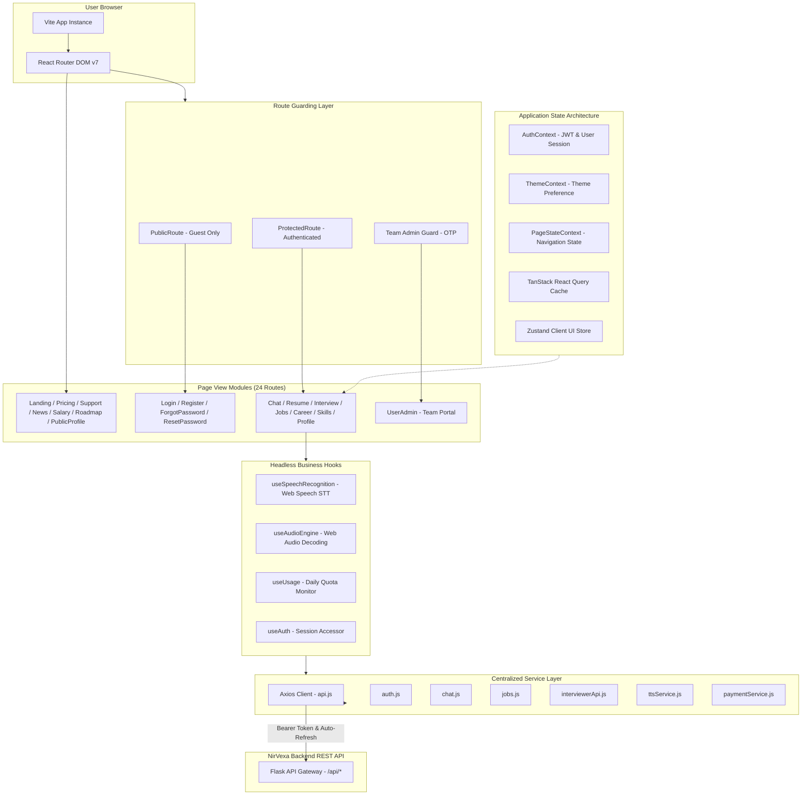
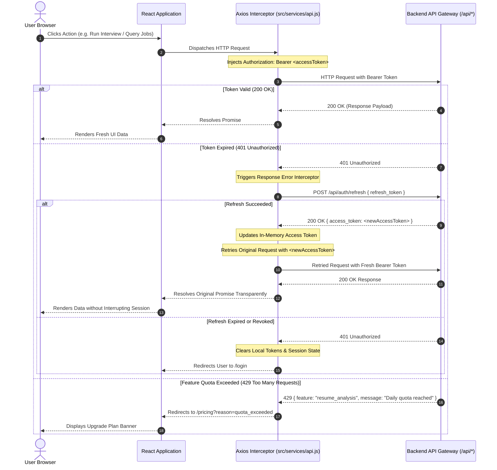

# Frontend Documentation — NirVexa

> High-performance React 19 single-page application powering the NirVexa career acceleration, AI interview intelligence, ATS resume studio, and talent analytics platform.

---

## Table of Contents

1. [Overview](#overview)
2. [Flagship Capabilities & Feature Highlights](#flagship-capabilities--feature-highlights)
3. [Technology Stack](#technology-stack)
4. [Why These Technologies? (Design & Technical Rationale)](#why-these-technologies-design--technical-rationale)
5. [Why This Project Structure? (Architectural Rationale)](#why-this-project-structure-architectural-rationale)
6. [System Architecture](#system-architecture)
7. [Repository & Directory Structure](#repository--directory-structure)
8. [Folder-by-Folder Responsibilities](#folder-by-folder-responsibilities)
9. [Pages & Routing Matrix](#pages--routing-matrix)
10. [State Management Strategy](#state-management-strategy)
11. [API Integration & Token Lifecycle](#api-integration--token-lifecycle)
12. [Audio & Speech Engine (AI Mock Interview)](#audio--speech-engine-ai-mock-interview)
13. [UI, Styling & Design System](#ui-styling--design-system)
14. [Environment Variables](#environment-variables)
15. [How to Run (Development Setup)](#how-to-run-development-setup)
16. [Available NPM Scripts](#available-npm-scripts)
17. [Build & Production Deployment (Vercel)](#build--production-deployment-vercel)
18. [Troubleshooting & Common Questions](#troubleshooting--common-questions)
19. [Known Limitations & Future Roadmap](#known-limitations--future-roadmap)

---

## Overview

The **NirVexa Frontend** is a modern, accessible, and responsive single-page web application engineered with **React 19**, **Vite 8**, and **Tailwind CSS 3.4**. Designed specifically for engineering candidates, job seekers, and hiring organizations, it delivers real-time AI career intelligence, interactive voice interviews, ATS resume optimization, and data-driven career roadmaps.

The application communicates with the **NirVexa Backend** (Flask / Python / SQLAlchemy / Celery / Redis / Postgres / ChromaDB / Local Ollama & Cloud LLMs) through an authenticated REST API gateway.

---

## Flagship Capabilities & Feature Highlights

* **AI Career Assistant & Multi-Session Chat (`/chat`)**:
  * Real-time markdown parsing with GitHub-flavored markdown (`remark-gfm`).
  * Syntax-highlighted code blocks (`react-syntax-highlighter`) with one-click clipboard copying.
  * Thread persistence across multiple independent conversation sessions.
  * Contextual prompt suggestion chips for technical interview prep, salary negotiation, and system design.

* **Real-Time AI Mock Interview Cockpit (`/interview`)**:
  * Voice-first conversational interview cockpit with live microphone capture via the Web Speech API.
  * Multi-tier Text-to-Speech (TTS) engine supporting high-fidelity neural audio (ElevenLabs / Edge-TTS) with seamless fallback to browser `window.speechSynthesis`.
  * Synchronized, word-by-word active caption playback (`SyncedCaption.jsx`).
  * Interactive animated avatar states (`LottieAvatar.jsx`) reflecting AI speaking, listening, and thinking modes.
  * Instant post-interview evaluation across clarity, technical correctness, problem-solving, and structure.

* **Dual-Mode ATS Resume Studio (`/resume`)**:
  * **ATS Score Analyzer**: Drag-and-drop resume upload (`react-dropzone`) for instant ATS compatibility scoring, keyword gap analysis, and bullet-point impact feedback.
  * **Interactive Resume Builder**: Real-time LaTeX resume template customizer with live document preview and client/server PDF generation.

* **Smart Job Search & Semantic Matching (`/jobs`, `/saved`)**:
  * Hybrid search engine combining traditional keyword queries with vector-based semantic relevance scoring.
  * Multi-tier filtering across seniority, employment type, location, remote status, and salary range.
  * Personal application tracker (Saved, Applied, Interviewing, Offered).

* **Career Learning Roadmaps & Interactive Skill Graph (`/career`, `/roadmap-graph`)**:
  * Step-by-step career path projections detailing milestones, prerequisite competencies, and time estimates.
  * Interactive node graph visualizing skill dependencies and technology stacks.

* **Salary Benchmarks & Company Intelligence (`/salary`, `/company`)**:
  * Compensation distribution analytics segmented by job role, experience level, and geographic market.
  * In-depth company profiles aggregating engineering culture, technology stacks, and interview difficulty ratings.

* **Verified Talent Portfolio (`/u/:username`, `/profile`)**:
  * Public shareable portfolio pages highlighting verified skills, project repositories, and interview badges.
  * Account preference management, theme selection, and target career settings.

* **Two-Factor Authenticated Team Admin Portal (`/teamadmin`)**:
  * Secure team administrator console protected by time-based OTP verification.
  * Full CRUD workflows for job postings, candidate applications, and company profile moderation.

* **Subscription Checkout & Quota Metering (`/pricing`)**:
  * Plan matrix (Free, Pro, Premium) integrated with **Razorpay** client-side checkout.
  * Proactive client-side daily quota tracking (`useUsage`) and non-intrusive upgrade prompts.

---

## Technology Stack

| Category | Package / Tool | Version | Purpose |
| :--- | :--- | :--- | :--- |
| **Core Framework** | React | `^19.2.4` | Component-driven declarative UI architecture |
| **DOM Renderer** | React DOM | `^19.2.4` | Virtual DOM diffing, reconciliation, and event handling |
| **Build & Dev Tool** | Vite | `^8.0.4` | Lightning-fast ESM dev server and Rollup-optimized bundler |
| **Routing** | React Router DOM | `^7.14.1` | Declarative client-side routing, URL state, and route guards |
| **Styling** | Tailwind CSS | `^3.4.19` | Utility-first responsive CSS framework with design tokens |
| **CSS Processing** | PostCSS / Autoprefixer | `^8.5.9` / `^10.5.0` | Cross-browser CSS transformations and vendor prefixing |
| **Typography Plugin** | `@tailwindcss/typography` | `^0.5.19` | Prose typographic defaults for markdown and rich documents |
| **Server State / Caching**| `@tanstack/react-query` | `^5.99.0` | Asynchronous query management, caching, and auto-refetching |
| **Client State** | Zustand | `^5.0.12` | Lightweight, unopinionated global UI store |
| **HTTP Client** | Axios | `^1.15.0` | Interceptor-driven REST communication with JWT refresh lifecycle |
| **Code Editor** | CodeMirror 6 | `^6.0.2` | Browser-based code editing for coding interview evaluations |
| **Iconography** | Lucide React | `^1.14.0` | Consistent, accessible, tree-shakeable SVG vector icons |
| **Markdown Parser** | React Markdown / Remark GFM | `^10.1.0` / `^4.0.1` | GitHub-flavored markdown parsing for chat and analysis |
| **Syntax Highlighting** | React Syntax Highlighter | `^16.1.1` | Code block highlighting across 50+ programming languages |
| **Notifications** | React Hot Toast | `^2.6.0` | Non-blocking toast notifications with customizable alerts |
| **File Drag & Drop** | React Dropzone | `^15.0.0` | Accessible drag-and-drop file ingestion for resume uploads |
| **Client PDF Export** | jsPDF | `^4.2.1` | Client-side document assembly and PDF generation |
| **Micro-Animations** | Lottie React / DotLottie | `^2.4.1` / `^0.13.0` | Vector animation playback for interactive interview avatars |
| **OAuth Integration** | `@react-oauth/google` | `^0.13.5` | Google Identity Services One-Tap and sign-in button SDK |
| **SEO Optimization** | `vite-plugin-sitemap` | `^0.8.2` | Automated production `sitemap.xml` compiler |
| **Code Quality / Lint** | ESLint 9 | `^9.39.4` | Static analysis with React Hooks and Fast Refresh rules |

---

## Why These Technologies? (Design & Technical Rationale)

Every technology in the NirVexa frontend stack was intentionally selected to satisfy strict performance, maintainability, and user-experience criteria:

### 1. Why React 19?
* **Concurrent Rendering**: React 19's optimized reconciliation allows high-frequency audio stream updates and synchronized transcript rendering to run smoothly without dropping frames or blocking user input.
* **Modern Hook Ergonomics**: Native hook abstractions (`useActionState`, `useOptimistic`, `useId`, and transitions) dramatically reduce boilerplate for form submissions and optimistic UI updates.
* **Ecosystem Maturity**: Guarantees seamless compatibility with industry-standard tooling (TanStack Query, React Router v7, Zustand, and CodeMirror).

### 2. Why Vite 8?
* **Instantaneous Development Cycles**: Vite leverages native ES Modules (ESM) in modern browsers, delivering cold server starts in milliseconds regardless of project scale.
* **Granular Hot Module Replacement (HMR)**: Changes to individual UI components or CSS classes reflect instantaneously in the browser without resetting complex interview or chat state.
* **Rollup Production Bundling**: Automatically performs intelligent code splitting, dead-code elimination (tree-shaking), and asset hashing for optimal CDN caching.

### 3. Why Tailwind CSS 3.4 & `@tailwindcss/typography`?
* **Zero Runtime Overhead**: Styles are compiled ahead-of-time into a tiny, purged CSS file, eliminating CSS-in-JS parsing costs in user devices.
* **Cohesive Design System**: Enforces design constraints through a centralized token configuration (`tailwind.config.js`), guaranteeing visual consistency across dark mode, typography, borders, and animations.
* **Prose Styling**: `@tailwindcss/typography` provides beautiful, out-of-the-box typographic rhythm for LLM-generated markdown, tables, and bullet lists without writing manual selectors.

### 4. Why TanStack Query v5 + Zustand (Hybrid State)?
* **Clear Separation of State Boundaries**:
  * **Server Cache (`@tanstack/react-query`)**: Manages asynchronous server state (job listings, news articles, salary metrics). Provides automatic background deduplication, cache invalidation, polling, and retry mechanisms.
  * **Client Store (`Zustand`)**: Manages lightweight, ephemeral UI state (sidebar drawer toggle, interview active step, filter state) with zero context re-render overhead.

### 5. Why Axios with Custom Interceptors?
* **In-Memory JWT + Silent Refresh**: Access tokens are kept in JavaScript memory to eliminate XSS token extraction vulnerabilities. The Axios response interceptor catches `401 Unauthorized` responses and silently requests a new access token via the refresh endpoint before replaying the failed request seamlessly.
* **Global Error Normalization**: Centralizes HTTP status handling (e.g., `429 Too Many Requests` redirects to `/pricing?reason=quota_exceeded`).

### 6. Why Web Speech API + Multi-Tier Neural TTS?
* **Zero-Latency Client Voice Capture**: Utilizing the native browser `webkitSpeechRecognition` eliminates the bandwidth and latency overhead of streaming raw audio to external STT services.
* **Audio Fallback Resilience**: If premium neural TTS endpoints (ElevenLabs / Edge-TTS) encounter network congestion or quota limits, the audio engine automatically falls back to browser-native `window.speechSynthesis`.

### 7. Why CodeMirror 6?
* **Extensible & Lightweight**: Unlike monolithic editors, CodeMirror 6 is organized as modular functional extensions, enabling fast syntax highlighting and line numbers for technical interviews without loading hundreds of kilobytes of unused languages.

### 8. Why Lucide React?
* **Consistency & Tree-Shaking**: Provides over 1,000 clean, geometrically consistent icons as independent ES modules. Only the icons specifically imported are bundled into the final build.

---

## Why This Project Structure? (Architectural Rationale)

The directory hierarchy follows a **domain-guided, modular separation of concerns**. Rather than grouping code arbitrarily, every directory has a single, well-defined architectural responsibility:

```
UI Views (pages/)  ──►  Reusable Primitives (components/)  ──►  Context & State (context/, Zustand)
        │                                                                  │
        ▼                                                                  ▼
Business Hooks (hooks/)  ──────────────────────────────►  Data Transport (services/)
```

### Architectural Principles Applied:

1. **Separation of Concerns (SoC)**:
   * Presentation logic lives exclusively in `pages/` and `components/`.
   * Business logic and browser API interactions live inside headless custom hooks in `hooks/`.
   * Network transport, payload construction, and response transformation live inside `services/`.
   * Cross-cutting application state lives inside `context/` and stores.

2. **Atomic Component Hierarchy (`components/`)**:
   * `components/layout/`: Architectural scaffolding (`Navbar`, `Sidebar`, `Layout`) that determines layout grids and mobile navigation drawers.
   * `components/ui/`: Dumb, reusable atomic primitives (`Button`, `Input`, `LoadingSpinner`, `ModelBadge`, `QuotaBanner`) that receive props and emit events without knowing about API endpoints.
   * Root `components/`: Feature-specific compound components (`LottieAvatar`, `SyncedCaption`, `TemplateMockup`) that bridge specific visual behaviors with business state.

3. **Centralized Service Layer (`services/`)**:
   * View components **never** execute raw `fetch()` or `axios.get()` calls. Instead, they invoke semantic service methods (e.g., `chatService.sendMessage()`, `jobsService.getSavedJobs()`).
   * If backend endpoint URLs or payload formats change, updates are confined to a single file in `services/` without touching UI templates.

4. **Headless Custom Hooks for Browser Subsystems (`hooks/`)**:
   * Complex browser APIs (like the Web Speech API and Web Audio API) have intricate event lifecycles.
   * Encapsulating these in `useSpeechRecognition` and `useAudioEngine` separates DOM event handling from visual rendering, making testing and maintenance straightforward.

5. **Centralized Routing & Security Guards (`App.jsx`)**:
   * All routes, URL parameters, and permission guards (`ProtectedRoute`, `PublicRoute`) are declared in one authoritative routing manifest, preventing hidden or unmapped endpoints.

---

## System Architecture



---

## Repository & Directory Structure

```text
nirvexa-frontend/
├── public/                         # Static web assets served directly by Vite
│   ├── favicon.svg                 # Application favicon
│   ├── hero-mockup.png             # Marketing visual asset
│   ├── resume-preview.png          # Resume template preview image
│   └── robots.txt                  # Search engine crawling directives
│
├── src/
│   ├── assets/                     # Packaged vector graphics and logos
│   │
│   ├── components/                 # UI components
│   │   ├── layout/                 # High-level layout framing
│   │   │   ├── Layout.jsx          # Root container wrapping navbar and responsive page body
│   │   │   ├── Navbar.jsx          # Header navigation bar with user profile dropdown & quotas
│   │   │   └── Sidebar.jsx         # Collapsible navigation drawer for authenticated views
│   │   │
│   │   ├── ui/                     # Pure atomic UI controls
│   │   │   ├── Button.jsx          # Standardized button variants (primary, secondary, danger)
│   │   │   ├── Input.jsx           # Form input field with validation and error states
│   │   │   ├── LoadingSpinner.jsx  # SVG animated activity indicator
│   │   │   ├── ModelBadge.jsx      # AI model provider pill (e.g. Gemini, Llama 3.2)
│   │   │   └── QuotaBanner.jsx     # Usage limit alert banner with upgrade action
│   │   │
│   │   ├── AuthPromptModal.jsx     # Conversion modal prompting guests to register/log in
│   │   ├── CursorEffect.jsx        # Subtle ambient mouse glow animation for landing views
│   │   ├── LottieAvatar.jsx        # Animated AI interviewer persona driven by Lottie
│   │   ├── SEO.jsx                 # Document head manager updating page title and description
│   │   ├── SyncedCaption.jsx       # Word-by-word synchronized speech caption renderer
│   │   └── TemplateMockup.jsx      # Resume template card preview with zoom and selection
│   │
│   ├── context/                    # React Context providers for global state
│   │   ├── AuthContext.jsx         # User authentication, token storage, and session refresh
│   │   ├── PageStateContext.jsx    # Retains search queries, active tabs, and navigation history
│   │   └── ThemeContext.jsx        # Dark/light theme toggle and persistence
│   │
│   ├── hooks/                      # Headless custom React hooks
│   │   ├── useAudioEngine.js       # Web Audio API manager for TTS playback and stream handling
│   │   ├── useAuth.js              # Convenient accessor hook consuming AuthContext
│   │   ├── useAuthPrompt.js        # Manages guest trigger limits and modal popups
│   │   ├── useSpeechRecognition.js # Web Speech API voice capture, interim results, and STT
│   │   └── useUsage.js             # Fetches and caches user daily feature usage quotas
│   │
│   ├── pages/                      # Application route views (24 distinct views)
│   │   ├── CareerPath.jsx          # Step-by-step career path planner with milestones
│   │   ├── Chat.jsx                # Multi-session AI career assistant with code highlighting
│   │   ├── CompanyResearch.jsx     # Deep-dive company intelligence search
│   │   ├── ForgotPassword.jsx      # Password reset request form
│   │   ├── Interview.jsx           # Interactive AI mock interview cockpit (voice & text)
│   │   ├── JobDetail.jsx           # Job listing breakdown with skill match percentage
│   │   ├── Jobs.jsx                # Searchable job board with filters and semantic scoring
│   │   ├── Landing.jsx             # High-conversion marketing landing page
│   │   ├── Login.jsx               # User authentication via email/password and Google OAuth
│   │   ├── News.jsx                # Curated tech, AI, and industry career news feed
│   │   ├── NotFound.jsx            # 404 error page with recovery navigation
│   │   ├── PremiumJobs.jsx         # Curated executive and high-compensation opportunities
│   │   ├── Pricing.jsx             # Subscription tier matrix with integrated Razorpay modal
│   │   ├── Profile.jsx             # User account settings, skill checklist, and preferences
│   │   ├── PublicProfile.jsx       # Public talent portfolio viewable at `/u/:username`
│   │   ├── Register.jsx            # New user account registration form
│   │   ├── ResetPassword.jsx       # Token-verified new password confirmation form
│   │   ├── Resume.jsx              # ATS resume analyzer and LaTeX resume builder
│   │   ├── RoadmapGraph.jsx        # Interactive skill dependency network graph
│   │   ├── SalaryInsights.jsx      # Industry compensation benchmark analytics
│   │   ├── SavedJobs.jsx           # Saved job applications tracker
│   │   ├── SkillMatch.jsx          # Resume-to-job description match comparison tool
│   │   ├── Support.jsx             # Customer support ticketing and contact form
│   │   └── UserAdmin.jsx           # Team administration portal for job moderation (`/teamadmin`)
│   │
│   ├── services/                   # Centralized HTTP transport and API modules
│   │   ├── api.js                  # Axios client configured with JWT interceptors
│   │   ├── auth.js                 # Authentication endpoints (register, login, google, refresh)
│   │   ├── chat.js                 # Chat session persistence and streaming endpoints
│   │   ├── interviewerApi.js       # Mock interview session management and scoring
│   │   ├── jobs.js                 # Job search, saving, filtering, and alert endpoints
│   │   ├── paymentService.js       # Razorpay checkout script loader and verification
│   │   ├── teamAdminService.js     # Two-factor admin authentication and job CRUD
│   │   └── ttsService.js           # Multi-tier text-to-speech audio synthesis bridge
│   │
│   ├── styles/                     # Supplementary CSS styling modules
│   ├── utils/                      # Pure helper functions
│   │   └── helpers.js              # Date formatting, score normalizers, currency converters
│   │
│   ├── App.css                     # Global custom utility classes and animations
│   ├── App.jsx                     # Top-level routing declaration and provider nesting
│   ├── index.css                   # Tailwind base, components, and utility imports
│   └── main.jsx                    # Application entry point mounting to `#root`
│
├── eslint.config.js                # ESLint flat configuration file
├── index.html                      # HTML shell template with fonts and meta viewport
├── package.json                    # Dependencies, metadata, and script definitions
├── postcss.config.js               # PostCSS plugin registration (Tailwind & Autoprefixer)
├── tailwind.config.js              # Custom color palette, fonts, and typography plugins
├── vercel.json                     # Vercel Single Page Application rewrite rules
└── vite.config.js                  # Vite configuration with React plugin and sitemap generator
```

---

## Folder-by-Folder Responsibilities

| Directory | Primary Responsibility | Key Files |
| :--- | :--- | :--- |
| `src/components/layout/` | Manages structural framing, layout grids, responsiveness, and drawer navigation. | `Layout.jsx`, `Navbar.jsx`, `Sidebar.jsx` |
| `src/components/ui/` | Provides isolated, reusable atomic UI primitives styled with Tailwind. | `Button.jsx`, `Input.jsx`, `LoadingSpinner.jsx`, `ModelBadge.jsx`, `QuotaBanner.jsx` |
| `src/components/` | Compound components combining multiple atoms for specific platform features. | `LottieAvatar.jsx`, `SyncedCaption.jsx`, `TemplateMockup.jsx`, `SEO.jsx` |
| `src/context/` | Stores global application state via React Context (authentication, theme, navigation). | `AuthContext.jsx`, `PageStateContext.jsx`, `ThemeContext.jsx` |
| `src/hooks/` | Headless custom React hooks encapsulating browser APIs, quotas, and state logic. | `useAudioEngine.js`, `useSpeechRecognition.js`, `useUsage.js`, `useAuth.js` |
| `src/pages/` | Top-level route views rendered when the URL matches a registered route. | `Landing.jsx`, `Chat.jsx`, `Interview.jsx`, `Resume.jsx`, `Jobs.jsx`, etc. |
| `src/services/` | Centralized data transport layer encapsulating all backend REST communication. | `api.js`, `auth.js`, `chat.js`, `interviewerApi.js`, `jobs.js`, `paymentService.js` |
| `src/utils/` | Stateless utility functions for text manipulation, date formatting, and math calculations. | `helpers.js` |

---

## Pages & Routing Matrix

All routes are centrally configured in `src/App.jsx` using `react-router-dom`:

| Path | Component | Access Level | Description |
| :--- | :--- | :--- | :--- |
| `/` | `Landing.jsx` | Public | Marketing landing page showcasing platform value proposition, features, and social proof. |
| `/login` | `Login.jsx` | Public (Guest only) | Email/password sign-in and Google One-Tap. Redirects to `/chat` if already authenticated. |
| `/register` | `Register.jsx` | Public (Guest only) | Account creation form with live password validation. Redirects to `/chat` on success. |
| `/forgot-password` | `ForgotPassword.jsx` | Public | Form for requesting password reset instructions via email. |
| `/reset-password` | `ResetPassword.jsx` | Public | Form for setting a new password using a secure query token. |
| `/pricing` | `Pricing.jsx` | Public | Subscription pricing tiers (Free, Pro, Premium) and Razorpay checkout modal. |
| `/support` | `Support.jsx` | Public | Customer support and contact form for submitting platform inquiries. |
| `/u/:username` | `PublicProfile.jsx` | Public | Publicly accessible talent portfolio showcasing verified skills, bio, and achievements. |
| `/news` | `News.jsx` | Public | Curated feed of tech, engineering, and career news articles. |
| `/salary` | `SalaryInsights.jsx` | Public | Compensation distribution calculator by role, experience level, and region. |
| `/company` | `CompanyResearch.jsx` | Public | Company research module highlighting culture, interview patterns, and tech stack. |
| `/roadmap-graph` | `RoadmapGraph.jsx` | Public | Interactive visual node graph showing career paths and skill prerequisite dependencies. |
| `/teamadmin` | `UserAdmin.jsx` | Protected (Team OTP) | Two-factor authenticated management console for team job posting and moderation. |
| `/useradmin` | `UserAdmin.jsx` | Protected (Team OTP) | Alias route pointing to the team administration console. |
| `/chat` | `Chat.jsx` | Protected (User) | AI career assistant with multi-session chat history and syntax-highlighted code output. |
| `/jobs` | `Jobs.jsx` | Protected (User) | Job discovery board featuring keyword search, faceted filters, and semantic relevance scores. |
| `/jobs/:id` | `JobDetail.jsx` | Protected (User) | Detailed job description view with skill gap breakdown and direct apply links. |
| `/premium-jobs` | `PremiumJobs.jsx` | Protected (Pro/Premium) | High-compensation, verified remote, and executive opportunities reserved for subscribers. |
| `/resume` | `Resume.jsx` | Protected (User) | Dual-mode resume center: ATS score analysis and LaTeX-compiled resume customization. |
| `/career` | `CareerPath.jsx` | Protected (User) | Milestone-based career path generator detailing projected growth timelines and skills. |
| `/interview` | `Interview.jsx` | Protected (User) | Voice- and text-based interactive mock interview with real-time feedback and scoring. |
| `/saved` | `SavedJobs.jsx` | Protected (User) | Application tracker for saved, applied, interviewing, and offered job roles. |
| `/profile` | `Profile.jsx` | Protected (User) | Account settings, skill inventory, target job titles, and portfolio privacy toggles. |
| `/skills` | `SkillMatch.jsx` | Protected (User) | Direct comparison between a target job description and the user's skill inventory. |
| `*` | `NotFound.jsx` | Public | Custom 404 page with recovery navigation links. |

---

## State Management Strategy

NirVexa uses a multi-tier state management strategy designed to eliminate unnecessary re-renders while keeping data synchronised:

```
┌─────────────────────────────────────────────────────────────────────────────┐
│                            STATE MANAGEMENT ARCHITECTURE                    │
├──────────────────────────┬──────────────────────────────────────────────────┤
│ Layer                    │ Mechanism & Responsibilities                     │
├──────────────────────────┼──────────────────────────────────────────────────┤
│ 1. Client Identity       │ AuthContext.jsx                                  │
│    & Authentication      │ • Keeps short-lived Access Token in-memory       │
│                          │ • Persists Refresh Token in localStorage         │
│                          │ • Automatically restores session on boot         │
├──────────────────────────┼──────────────────────────────────────────────────┤
│ 2. Server Cache          │ @tanstack/react-query                            │
│    & Async Remote State  │ • Caches remote queries (jobs, news, salaries)   │
│                          │ • Handles background invalidation & deduplication│
│                          │ • Optimistic mutations for saving/unsaving jobs  │
├──────────────────────────┼──────────────────────────────────────────────────┤
│ 3. Global UI State       │ Zustand                                          │
│                          │ • Manages sidebar collapsed state                │
│                          │ • Tracks active filter criteria and search terms │
│                          │ • Ephemeral interview stepper progression        │
├──────────────────────────┼──────────────────────────────────────────────────┤
│ 4. Page Navigation State │ PageStateContext.jsx                             │
│                          │ • Retains active tabs when navigating sub-routes │
│                          │ • Remembers scroll positions and search inputs   │
└──────────────────────────┴──────────────────────────────────────────────────┘
```

---

## API Integration & Token Lifecycle

All network traffic passes through the preconfigured Axios client defined in `src/services/api.js`:



---

## Audio & Speech Engine (AI Mock Interview)

The `/interview` cockpit integrates a two-way speech processing pipeline:

```
┌────────────────────────────────────────────────────────────────────────┐
│                     TWO-WAY INTERACTIVE AUDIO PIPELINE                 │
├───────────────────────────────────┬────────────────────────────────────┤
│ Voice Capture (Speech-to-Text)    │ Voice Synthesis (Text-to-Speech)   │
├───────────────────────────────────┼────────────────────────────────────┤
│ • Hook: useSpeechRecognition.js   │ • Hook: useAudioEngine.js          │
│ • Web Speech API interface        │ • Service: ttsService.js           │
│ • Real-time interim transcript    │ • Priority 1: Backend Neural TTS   │
│ • Automatic silence detection     │   (ElevenLabs or Edge-TTS stream)  │
│ • Fallback: Manual text input     │ • Priority 2: Browser Synthesis    │
│                                   │   (window.speechSynthesis)         │
│                                   │ • Word-by-word SyncedCaption.jsx   │
└───────────────────────────────────┴────────────────────────────────────┘
```

---

## UI, Styling & Design System

The frontend visual design is built with a cohesive dark-first aesthetic tailored for modern engineering interfaces:

* **Dark-First Surface Hierarchy**:
  * Root Background: Deep Obsidian Slate (`#0B0F17`)
  * Elevated Cards & Sidebars: Charcoal Zinc (`#121824`, `#1A2234`)
  * Structural Borders: Muted Charcoal (`#253046`)
* **Accents & Brand Identifiers**:
  * Primary Accent: Electric Indigo & Violet Gradient (`#6366F1` to `#8B5CF6`)
  * Success / Verified: Forest Emerald (`#10B981`)
  * Warning / Quota Limits: Amber Gold (`#F59E0B`)
  * Destructive / Critical: Crimson Ruby (`#EF4444`)
* **Responsive Breakpoints**:
  * Fully adapted using Tailwind's `sm:` (640px), `md:` (768px), `lg:` (1024px), and `xl:` (1280px) breakpoints for phones, tablets, laptops, and wide desktop displays.

---

## Environment Variables

Create a `.env` file in the root of `nirvexa-frontend` based on the template below:

```env
# Target Backend REST API Base URL (must include /api path)
VITE_API_URL=http://localhost:5000/api

# Google OAuth 2.0 Web Client ID (from Google Cloud Console)
VITE_GOOGLE_CLIENT_ID=your-google-client-id.apps.googleusercontent.com

# Razorpay Key ID for Client Checkout Modal (test or live key)
VITE_RAZORPAY_KEY_ID=rzp_test_your_key_id
```

### Configuration Details

| Variable | Required? | Default (Local) | Purpose |
| :--- | :--- | :--- | :--- |
| `VITE_API_URL` | **Yes** | `http://localhost:5000/api` | Base URL for all backend HTTP requests dispatched by Axios. |
| `VITE_GOOGLE_CLIENT_ID` | Optional | `""` | Enables Google One-Tap and the Google Sign-In button on `/login` and `/register`. |
| `VITE_RAZORPAY_KEY_ID` | Optional | `""` | Public Razorpay key required to initialize the subscription checkout modal on `/pricing`. |

---

## How to Run (Development Setup)

### 1. Prerequisites
* **Node.js**: `v18.0.0` or higher (`v20+ LTS` strongly recommended). Check with:
  ```bash
  node -v
  ```
* **npm**: `v9.0.0` or higher. Check with:
  ```bash
  npm -v
  ```
* **NirVexa Backend**: Running locally on `http://localhost:5000` (or your remote API gateway).

### 2. Step-by-Step Installation

1. Clone the repository and navigate into the frontend directory:
   ```bash
   git clone https://github.com/kunalx30/nirvexa-frontend.git
   cd nirvexa-frontend
   ```

2. Install dependencies:
   ```bash
   npm install
   ```

3. Configure your local environment file:
   ```bash
   cp .env.example .env
   ```
   *(Ensure `VITE_API_URL=http://localhost:5000/api` is configured)*

4. Start the local Vite development server:
   ```bash
   npm run dev
   ```

5. Open your browser and navigate to:
   ```
   http://localhost:5173
   ```

---

## Available NPM Scripts

All commands are defined in `package.json`:

```bash
# Start the local development server with Hot Module Replacement
npm run dev

# Compile and optimize the application into the /dist directory for production
npm run build

# Run ESLint across all source files to catch syntax or hook violations
npm run lint

# Start a local HTTP server to preview the compiled /dist production build
npm run preview
```

---

## Build & Production Deployment (Vercel)

### Compiling for Production
Running `npm run build` initiates:
1. `vite build`: Transpiles JSX, performs tree-shaking, bundles CSS with PostCSS, and splits code into optimized vendor chunks.
2. `vite-plugin-sitemap`: Automatically compiles a public `sitemap.xml` based on all defined public routes.

All compiled production artifacts are generated in the `dist/` directory.

### Deployment on Vercel
The repository includes a production-ready `vercel.json` configuration for seamless deployment:

```json
{
  "rewrites": [
    { "source": "/(.*)", "destination": "/index.html" }
  ]
}
```

This single-page application rewrite rule ensures that deep URLs (e.g., navigating directly to `https://nirvexa.com/interview` or `https://nirvexa.com/resume`) correctly resolve to `index.html`, allowing `react-router-dom` to handle client-side route resolution without 404 errors.

---

## Troubleshooting & Common Questions

### 1. The microphone does not respond during mock interviews
* **Cause**: Browser microphone permissions have not been granted, or the browser does not support the Web Speech API.
* **Resolution**:
  * Verify that your browser URL bar displays a microphone icon and permissions are set to "Allow".
  * The Web Speech API is natively supported in Google Chrome, Microsoft Edge, Brave, and Safari. For Firefox desktop, ensure `media.webspeech.recognition.enable` is toggled to `true` in `about:config`, or use the manual text-input fallback.

### 2. API requests fail with CORS errors (`Access-Control-Allow-Origin`)
* **Cause**: The backend Flask API is not configured to allow requests from the frontend development port (`http://localhost:5173`).
* **Resolution**: Ensure the backend `.env` file includes `FRONTEND_URL=http://localhost:5173` and `CORS_ORIGINS=http://localhost:5173,http://localhost:3000`.

### 3. Google Sign-In button fails to render
* **Cause**: `VITE_GOOGLE_CLIENT_ID` is unset or invalid for the current origin.
* **Resolution**: Ensure `VITE_GOOGLE_CLIENT_ID` in `.env` is set to a valid client ID created in the Google Cloud Console with `http://localhost:5173` added under Authorized JavaScript Origins.

### 4. Audio output does not play automatically
* **Cause**: Modern web browsers enforce strict Autoplay policies preventing audio playback before the user interacts with the page.
* **Resolution**: Click anywhere on the interview cockpit (e.g., the "Start Interview" button) to allow the browser's `AudioContext` to initialize.

---

## Known Limitations & Future Roadmap

### Current Considerations
* **Web Speech Recognition Browser Variance**: Speech recognition accuracy varies depending on the client OS and browser engine.
* **In-Memory Token Reset on Hard Refresh**: Hard-reloading the browser clears in-memory state, briefly triggering a background token refresh before protected views render.

### Future Roadmap
* **WebSocket / Server-Sent Events (SSE)**: Enable token-by-token streaming for real-time AI interview questions and chat responses.
* **Progressive Web App (PWA)**: Implement service worker caching for offline resume viewing and mobile home screen installation.
* **Comprehensive Automated Testing**: Add unit and component test coverage via **Vitest** and **React Testing Library**, plus end-to-end user flows with **Playwright**.
* **Audio Waveform Visualizer**: Implement Web Audio API frequency analysis visualizers during candidate speech.

---

## Authors & Acknowledgments

* **NirVexa Engineering Team** — [@kunalx30](https://github.com/kunalx30)
* Built with [React](https://react.dev/), [Vite](https://vitejs.dev/), and [Tailwind CSS](https://tailwindcss.com/).
